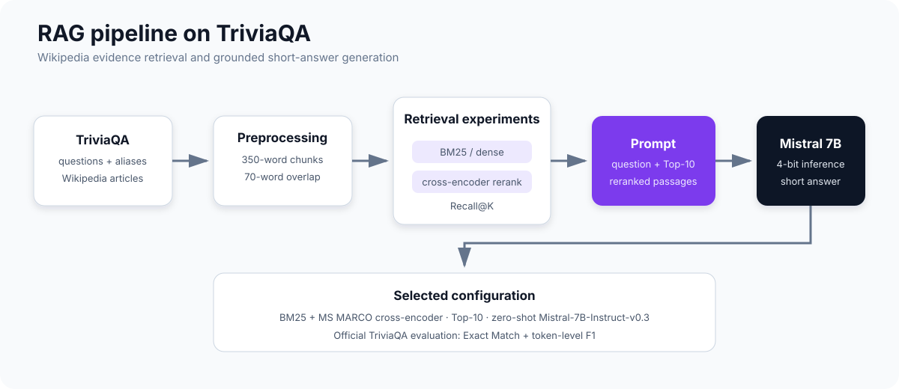

# Retrieval-Augmented Question Answering on TriviaQA

An experimental Retrieval-Augmented Generation (RAG) pipeline for open-domain question answering over the Wikipedia evidence collection in [TriviaQA](https://nlp.cs.washington.edu/triviaqa/). The project covers data preparation, passage retrieval, reranking, prompt design, open-weight LLM comparison, and end-to-end evaluation.

## Key result

The selected pipeline combines **BM25 retrieval**, an **MS MARCO cross-encoder reranker**, the **Top-10 passages**, and **zero-shot Mistral-7B-Instruct-v0.3**.

| Evaluation set | Questions | Exact Match | F1 |
|---|---:|---:|---:|
| Validation | 7,900 | **76.10%** | **83.89%** |
| Verified test | 318 | **83.16%** | **90.20%** |

On the same verified test set, Mistral without retrieved context scores 73.06% EM and 79.32% F1. Adding retrieval and reranking improves the result by **10.10 EM points** and **10.88 F1 points**.

  

## Project scope

This is a compact research study rather than a production service. It investigates four practical questions:

1. How do sparse, dense, and reranked retrieval compare?
2. How much retrieved context should be passed to the generator?
3. Which compact instruction-tuned model performs best under Colab-scale constraints?
4. How do zero-shot, few-shot, and span-extraction prompts affect answer quality?

No model is fine-tuned. Improvements come from evidence preparation, retrieval, reranking, prompt design, and configuration selection.

## Pipeline

### 1. Data preparation

The project uses the RC version of TriviaQA and restricts evidence to Wikipedia `EntityPages`.

- The first 7,900 examples from `wikipedia-train.json` form the validation set.
- `verified-wikipedia-dev.json` provides the 318-question verified test set.
- Questions, canonical answers, aliases, and evidence paths are flattened into Hugging Face datasets.
- Referenced Wikipedia articles are cleaned and stored in a document index.

### 2. Passage construction

Long Wikipedia articles are split into overlapping retrieval units:

- chunk size: **350 words**;
- overlap: **70 words**;
- metadata retained: source document identifier.

The overlap reduces the chance of losing an answer span at a chunk boundary.

### 3. Retrieval

| Strategy | Implementation | Role |
|---|---|---|
| Sparse | BM25 | Fast lexical baseline |
| Dense | `all-MiniLM-L6-v2` | Semantic nearest-neighbour retrieval |
| Hybrid | BM25 + `ms-marco-MiniLM-L-6-v2` | Candidate retrieval followed by cross-encoder reranking |

Retrieval is evaluated with Recall@K. A passage is considered relevant when it contains at least one normalized gold-answer alias.

### 4. Generation

Six instruction-tuned, open-weight model configurations are compared in 4-bit quantization:

- Phi-3 Mini 4K Instruct (3.8B)
- Gemma 2B Instruct
- Mistral-7B-Instruct-v0.3
- Llama-2-7B Chat
- Qwen2-1.5B Instruct
- Qwen3-8B

The generator receives an instruction, the question, and the highest-ranked passages that fit its context window. Its output is normalized and scored against the canonical answer and aliases.

## Experimental results

### Retrieval quality

The hybrid retriever is strongest at every measured depth, with the largest advantage when only a few passages can be supplied.

| K | BM25 | Dense | BM25 + reranker |
|---:|---:|---:|---:|
| 1 | 69.14% | 72.61% | **79.80%** |
| 3 | 86.51% | 88.04% | **90.75%** |
| 5 | 90.96% | 92.03% | **93.80%** |
| 7 | 93.24% | 94.25% | **95.30%** |
| 10 | 95.13% | 95.61% | **96.23%** |
| 20 | 97.44% | 97.53% | **97.54%** |

Approximately 97.5% of validation questions have at least one answer alias in their associated evidence, which forms an empirical ceiling for this relevance definition.

### Generator comparison

The initial generator study uses the same 400 validation questions for every model, prompt, and retrieval depth. These are each model's best observed configurations by F1 in that comparison.

| Generator | Prompt | Top-K | EM | F1 |
|---|---|---:|---:|---:|
| Gemma 2B | Few-shot | 7 | 38.0% | 46.8% |
| Llama 2 7B | Few-shot | 5 | 55.5% | 63.7% |
| Phi-3 Mini | Zero-shot | 3 | 55.8% | 66.0% |
| Qwen2 1.5B | Span extraction | 7 | 58.8% | 66.4% |
| Qwen3 8B | Few-shot | 3 | 56.0% | 70.0% |
| **Mistral v0.3 7B** | **Zero-shot** | **7** | **70.7%** | **77.9%** |

A follow-up study on 2,000 validation questions uses Mistral with BM25 + reranking. Performance improves until roughly Top-10 and then plateaus, motivating the final configuration.

## Run the notebooks

The notebooks are designed for Google Colab and Google Drive.

### Requirements

- a Google account with Drive storage;
- a Hugging Face account and access token;
- accepted access conditions for any gated model used;
- a CUDA GPU with enough memory for 4-bit inference.

The reported experiments used Colab Pro with an NVIDIA L4 GPU and a high-RAM runtime.

### Execution order

1. Open [`Data.ipynb`](Data.ipynb) or its [Colab version](https://colab.research.google.com/drive/12sLHN2lH-Z8kdu29Zms1zZCN2CnZl8Ot?usp=sharing).
2. Mount Google Drive, download TriviaQA, and build the splits and document store.
3. Open [`Project.ipynb`](Project.ipynb) or its [Colab version](https://colab.research.google.com/drive/1_stgRKaDRQYkhEhGg6pLPGe48qnkTHef?usp=sharing).
4. Confirm the Drive paths and authenticate with Hugging Face.
5. Run retrieval evaluation, load one generator configuration, and execute the end-to-end QA cells.

The installation cells inside the notebooks install the required libraries, including `datasets`, `rank-bm25`, `sentence-transformers`, `transformers`, and the quantization dependencies.

## Repository structure

~~~text
Data.ipynb          downloads and prepares TriviaQA and its Wikipedia docstore
Project.ipynb       retrieval, reranking, generation, prompts, and evaluation
Report.pdf          methodology, complete result tables, prompts, and discussion
docs/rag-pipeline.svg
                    high-level architecture used in this README
~~~

## Evaluation notes

- Retrieval Recall@K is measured on all 7,900 validation questions.
- The six-model comparison uses a shared 400-question validation subset.
- Retrieval-depth selection for Mistral uses 2,000 validation questions.
- Final scores use all 7,900 validation questions and 318 verified test questions.
- Exact Match and token-level F1 are computed with the official TriviaQA scorer.
- Results depend on the documented dataset snapshots, model revisions, hardware, and inference configuration.

## Report and references

See [`Report.pdf`](Report.pdf) for the full methodology, prompt templates, experimental tables, limitations, and bibliography.

Core references:

- Joshi et al., [TriviaQA: A Large Scale Distantly Supervised Challenge Dataset for Reading Comprehension](https://aclanthology.org/P17-1147/) (ACL 2017)
- Robertson and Zaragoza, *The Probabilistic Relevance Framework: BM25 and Beyond* (2009)
- Reimers and Gurevych, [Sentence-BERT](https://aclanthology.org/D19-1410/) (EMNLP-IJCNLP 2019)
